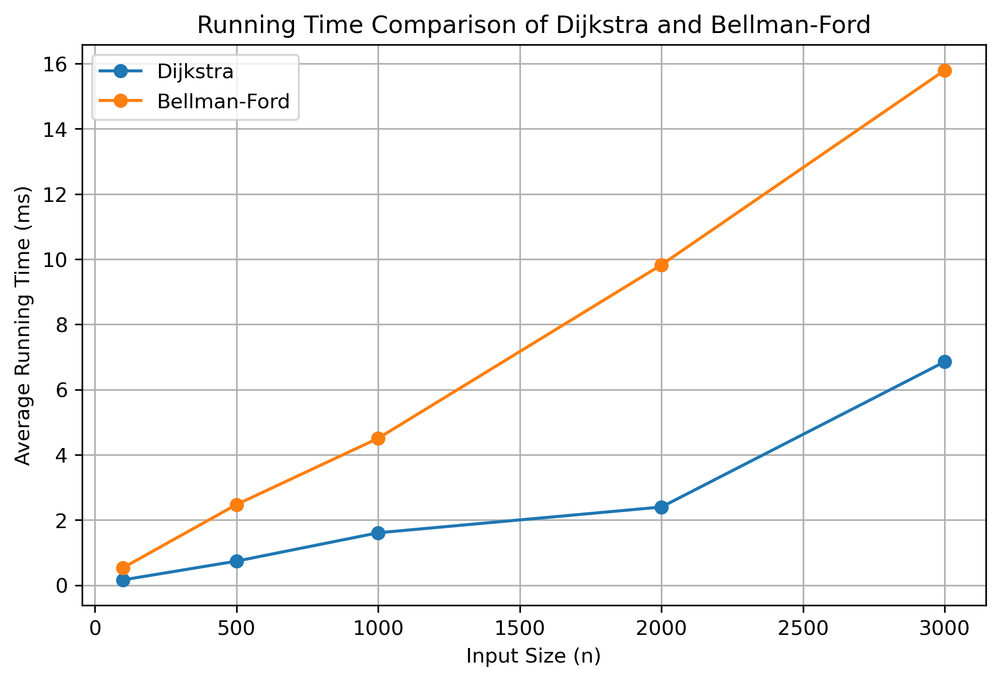

# Road-Network-Algorithm-Comparison

Developed as a final project for CSC301: Algorithm Analysis and Design.

This project compares the performance of Dijkstra and Bellman-Ford shortest path algorithms using a real-world road network dataset from the Stanford Network Analysis Project (SNAP).

---

## Project Objective

The main goal of this project is to analyze and compare the execution time, efficiency, and computational complexity of:

- Dijkstra Algorithm
- Bellman-Ford Algorithm

Both algorithms were tested using the same dataset, subgraphs, and source-target pairs to ensure a fair comparison.

---

## Dataset

- Dataset: roadNet-CA
- Source: Stanford Network Analysis Project (SNAP)
- Graph Type: Undirected Road Network
- Nodes: 1,965,206
- Edges: 2,766,607

Each edge was assigned a weight of 1 because the original dataset is unweighted.

---

## Technologies & Tools

- Python
- NetworkX
- Matplotlib
- Jupyter Notebook

---

## Algorithms Used

### Dijkstra Algorithm
A greedy shortest-path algorithm optimized for graphs with non-negative edge weights.

### Bellman-Ford Algorithm
A relaxation-based algorithm capable of handling negative edge weights and detecting negative cycles.

---

## Experimental Setup

- Input sizes tested:
  - 100
  - 500
  - 1000
  - 2000
  - 3000

- Each experiment was repeated 5 times.
- Average execution time was measured using `time.perf_counter()`.

---

## Results

The experimental results showed that Dijkstra Algorithm consistently achieved lower running time compared to Bellman-Ford Algorithm for all tested input sizes.

As the graph size increased, the performance gap between the two algorithms became more noticeable.

---

## Running Time Comparison

---

## Repository Contents

- `Algorithm.ipynb` → Full implementation notebook
- `running_time_comparison.png` → Performance visualization
- `CSC301_Final_Report_Dijkstra_BellmanFord.pdf` → Final project report

---

## Team Members
- Jana Hassan Algarni
- Leen Abdulrahman Hadari
- Asma Abbas Albeshri
- Lujain Abdullah Alqahtani
- Alzahraa Hussein Alabbad

---

## Course Information

- Course: CSC301 – Algorithm Analysis and Design
- Instructor: Dr. Rahma Ahmed
- Team Name: Theta Thinkers

---

## References

- Stanford Network Analysis Project (SNAP)
- NetworkX Documentation
- Dijkstra (1959)
- Bellman-Ford (1958)

---
⭐ This project demonstrates practical shortest-path analysis on large-scale road-network graphs using real-world datasets.
